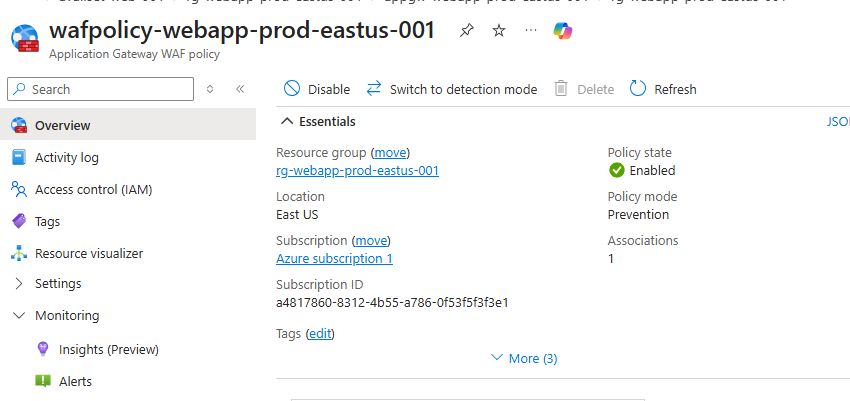

# Project 2 - Highly Available Web Application

## Overview

For this project I demonstrate how to deploy a highly available web application in Microsoft Azure using Terraform.

I followed Azure best practices by separating networking, security, compute, and application delivery into dedicated Azure resources.

Consists of two Windows Server virtual machines running IIS behind an Azure Application Gateway protected by a Web Application Firewall (WAF). The Application Gateway performs health monitoring and distributes incoming HTTP requests across healthy backend servers while providing a single public entry point.

All infrastructure was deployed using Terraform as Infrastructure as Code.

---

## Architecture

The solution contains:

- Azure Resource Group
- Azure Virtual Network
- Dedicated Subnets
- Network Security Groups
- Availability Set
- Two Windows Server 2022 Virtual Machines
- IIS Web Server installed automatically
- Azure Application Gateway (WAF_v2)
- Azure Public IP
- Health Probes
- Backend Pool
- HTTP Listener
- Routing Rules
- Web Application Firewall Policy

---

## Azure Resource Group

All Azure resources for this project were deployed into a dedicated Resource Group using Terraform.

---

## Azure Services Used

| Service | Purpose |
|---------|---------|
| Azure Resource Group | Organizes all project resources |
| Azure Virtual Network | Provides private networking |
| Azure Subnets | Separates application components |
| Network Security Groups | Controls inbound and outbound traffic |
| Availability Set | Provides VM high availability |
| Azure Virtual Machines | Hosts IIS web servers |
| Azure Network Interface | Connects VMs to the network |
| Azure Application Gateway | Layer 7 Load Balancer |
| Azure Public IP | Internet entry point |
| Azure Web Application Firewall | Protects against web attacks |
| Terraform | Infrastructure as Code |

---

## Networking

The deployment includes:

- Application Gateway Subnet
- Web Subnet
- Application Subnet
- Azure Bastion Subnet

This design allows each network tier to have its own Network Security Group while following Azure networking best practices.

---

## Network Security

Separate Network Security Groups were deployed to enforce least-privilege access between network tiers.

### Web Tier NSG

Allows HTTP traffic from the Application Gateway and RDP access only from Azure Bastion.

### Application Tier NSG

Allows application traffic (TCP 8080) from the Web subnet and SSH access only from Azure Bastion.

---

## High Availability

Both IIS web servers were deployed inside an Azure Availability Set to improve resiliency against hardware failures and planned Azure maintenance events.

---

## Azure Application Gateway

Azure Application Gateway (WAF_v2) provides Layer 7 load balancing, health monitoring, and a single public endpoint for the application.

---

## Web Application Firewall

The Application Gateway is protected using an Azure Web Application Firewall operating in Prevention Mode with the OWASP managed rule set.

---

## Deployment Process

1. Deploy Resource Group
2. Deploy Virtual Network
3. Deploy Subnets
4. Deploy Network Security Groups
5. Associate NSGs to Subnets
6. Deploy Availability Set
7. Deploy Network Interfaces
8. Deploy Windows Virtual Machines
9. Install IIS using VM Extensions
10. Deploy Public IP
11. Deploy Web Application Firewall Policy
12. Deploy Azure Application Gateway
13. Verify Health Probes
14. Validate Load Balancing
15. Test Automatic Failover

---

## Testing & Validation

The following tests were successfully completed:

- IIS installed automatically through Azure VM Extensions
- Application Gateway successfully routed HTTP requests
- Health probes detected healthy backend servers
- Requests alternated between both IIS servers
- VM failover was validated by deallocating one backend VM
- Application Gateway automatically redirected all traffic to the remaining healthy server
- Restoring the VM returned it to the backend pool automatically

### Backend Health

### Web Server 01

### Web Server 02

---

## Terraform Validation

The infrastructure was validated using Terraform to confirm that the deployed infrastructure matched the desired configuration.

---

## Lessons Learned

During this project I learned:

- How Azure Application Gateway performs Layer 7 load balancing
- The importance of dedicated subnets for Application Gateway
- How Availability Sets improve VM resilience
- How Azure Health Probes determine backend availability
- How VM Extensions automate software installation
- How Infrastructure as Code simplifies repeatable deployments
- How Web Application Firewall policies are associated with Application Gateway
