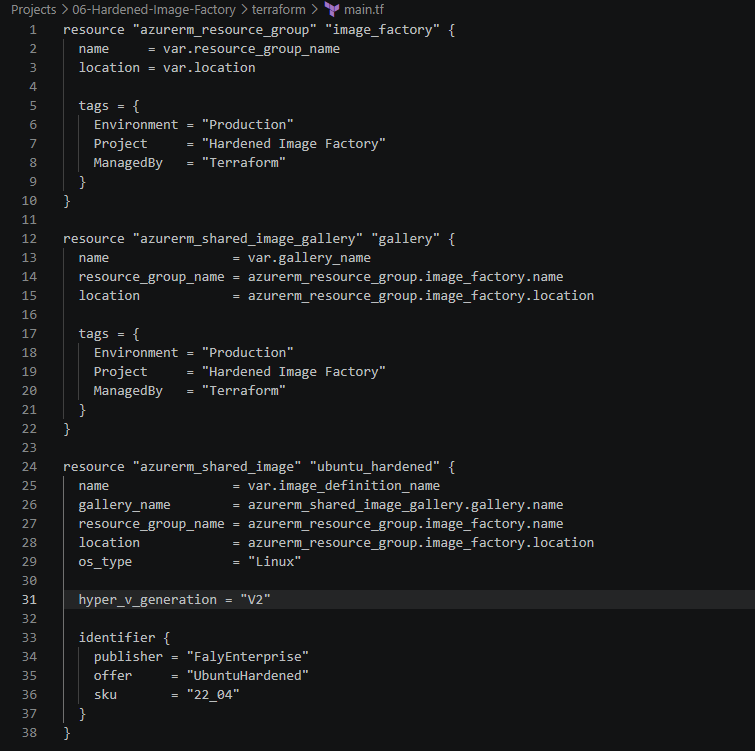
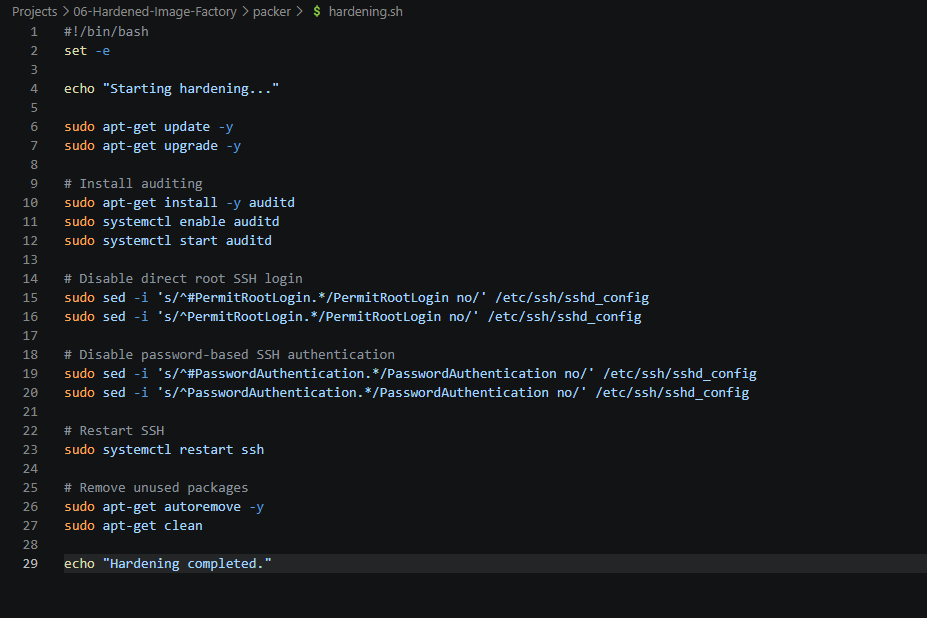
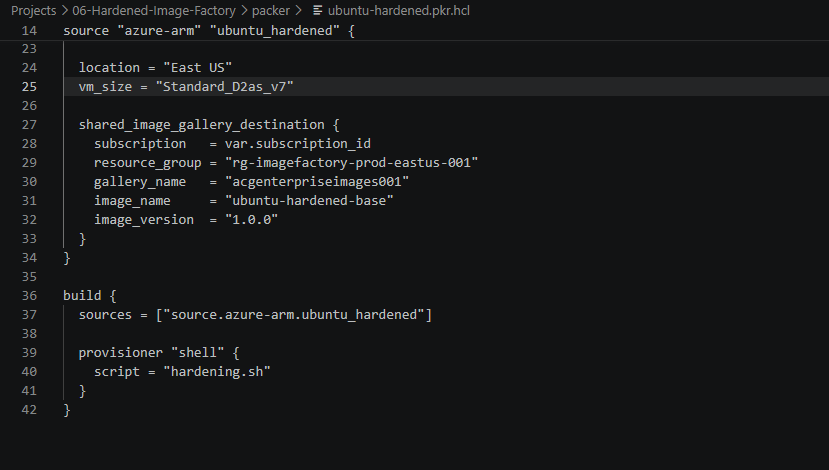
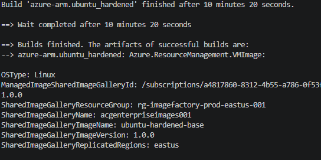
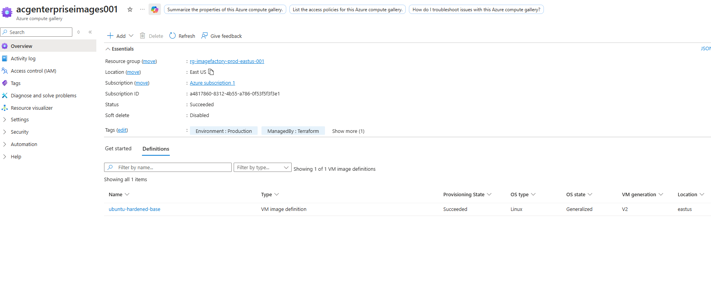
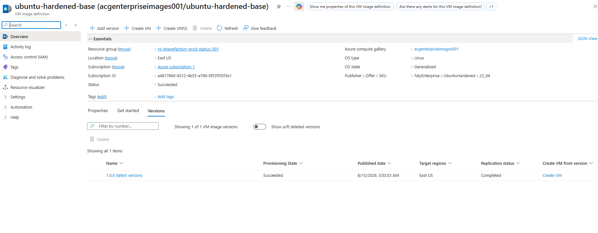

# 🚀 Project 6 – Hardened Image Factory

## 📌 Project Overview

For Project 6, I wanted to learn how enterprise organizations create secure, standardized virtual machine images instead of manually configuring every server after deployment.

The goal was simple:

**Build one approved and security-hardened Ubuntu image that can be reused throughout the entire environment.**

I used **Terraform** to deploy the Azure infrastructure, **HashiCorp Packer** to automatically build and harden the image, and **GitHub Actions** to automate the entire image creation process through a CI/CD pipeline. This was by far one of my more interesting projects.

The completed image was then published to **Azure Compute Gallery**, where it can be reused for future virtual machine deployments.

This project introduced me to:

- Infrastructure as Code (IaC)
- Image as Code
- CI/CD pipelines
- OIDC authentication
- Linux hardening
- Image versioning
- Azure Compute Gallery

---

# 🎯 Business Problem

Imagine a company with 500 virtual machines.

If every engineer builds servers manually, you eventually end up with:

- Different patch levels
- Different security configurations
- Unnecessary services running
- Inconsistent SSH settings
- Configuration drift

The solution is to create a **golden image**.
Instead of configuring every server individually, every future VM starts from the same approved baseline.

---

# 🏗️ Architecture


---

# 🛠️ Technologies Used

- Microsoft Azure
- Terraform
- HashiCorp Packer
- GitHub Actions
- OIDC Authentication
- Azure Compute Gallery
- Ubuntu 22.04 LTS
- Bash
- Git
- GitHub
- Azure CLI

---

# 🔨 Infrastructure Created with Terraform

## Resource Group

**rg-imagefactory-prod-eastus-001**

Purpose:
A dedicated resource group for the image factory.

---

## Azure Compute Gallery

**acgenterpriseimages001**

Purpose:
A centralized repository for approved virtual machine images.
Think of it as a company library that stores every approved server image.

---

## Image Definition

**ubuntu-hardened-base**

Configuration:

- OS Type: Linux
- OS State: Generalized
- VM Generation: V2

Purpose:

Defines the operating system family and image template that future image versions will follow.

---

## Terraform Infrastructure

Terraform deployed all of the Azure resources required for the image factory.



---

# 🔐 Security Hardening

The `hardening.sh` script automatically applied several security controls.

---

## Operating System Updates

```bash
apt-get update
apt-get upgrade -y
```

Purpose:
Installed the latest operating system updates.

Security benefit:
Reduces vulnerabilities caused by outdated software.

---

## Audit Logging

```bash
apt-get install auditd -y
```

Purpose:
Installed and enabled Linux audit logging.

Security benefit:
Creates a record of security-related system activity.

---

## Disable Root SSH Login

```bash
PermitRootLogin no
```

Purpose:
Prevents administrators from logging in directly as the root user.

Security benefit:
Protects the most privileged Linux account.

---

## Disable Password Authentication

```bash
PasswordAuthentication no
```

Purpose:
Disables password-based SSH authentication.

Security benefit:
Reduces the risk of brute-force password attacks.

---

## Remove Unnecessary Packages

```bash
apt autoremove -y
apt clean
```

Purpose:
Removes unused software packages.

Security benefit:
Reduces the attack surface.

---

## Linux Hardening Script

The entire hardening process was automated with a Bash script.



---

# 🏭 Packer Build Process

Packer automatically performed the following steps:

1. Connected to Azure.
2. Created a temporary resource group.
3. Deployed a temporary Ubuntu VM.
4. Connected to the VM through SSH.
5. Executed `hardening.sh`.
6. Applied security configurations.
7. Generalized the virtual machine.
8. Captured the image.
9. Published the image to Azure Compute Gallery.
10. Deleted all temporary resources.

---

## Packer Template

The Packer template defined the image source, VM size, hardening process, and Azure Compute Gallery destination.



---

## Successful Packer Build

The image was successfully built and published.



---

# 🚀 GitHub Actions CI/CD Pipeline

After successfully building the image manually, I automated the entire process using **GitHub Actions**.
Instead of running Packer commands locally, the pipeline now performs the entire build automatically.

Pipeline stages:

1. Checkout the repository.
2. Authenticate to Azure using OIDC.
3. Initialize Packer.
4. Validate the Packer template.
5. Build the hardened image.
6. Publish the image to Azure Compute Gallery.

Benefits of the pipeline:

- No stored passwords
- No client secrets
- Repeatable deployments
- Automated image creation
- Consistent image builds

---

## Successful GitHub Actions Pipeline

The CI/CD pipeline successfully built and published the hardened image.


---

# 🖼️ Azure Compute Gallery

The hardened image was successfully stored in Azure Compute Gallery.



---

## 📦 Image Version 1.0.0

The first production image version was successfully published.

| Component | Value |
| --- | --- |
| Gallery | acgenterpriseimages001 |
| Image | ubuntu-hardened-base |
| Version | 1.0.0 |
| Region | East US |
| Operating System | Ubuntu 22.04 LTS |
| VM Generation | V2 |



---

# 🔄 Future Improvements

Future enhancements for this project include:

- Automated semantic versioning
- Multi-region image replication
- CIS benchmark hardening
- Vulnerability scanning
- GitHub approval gates
- Azure Policy integration

---

# 💡 Key Takeaway

This was truly a challenging project, I ran into errors I had to fix manually. It really challenge my thinking and research skills. One of my favirote projects ao far. This project taught me that cloud security doesn't start after a server is deployed.
It starts before the server is ever created. Instead of securing every VM individually, security becomes part of the image itself. Every future server now starts from the same secure and approved baseline.

I also gained hands-on experience with:

- Terraform
- Packer
- GitHub Actions
- OIDC authentication
- Azure Compute Gallery
- CI/CD pipelines
- Linux hardening
- Image versioning
- Infrastructure as Code
- Image as Code

---